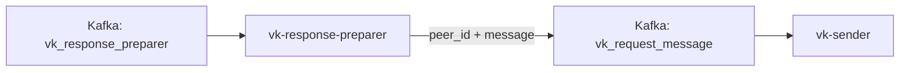

## О приложении

vk-response-preparer принимает `NormalizedResponse` из Kafka, извлекает `chat_id` и `text`, превращает их в формат `SendMessageRequest` (`peer_id`, `message`) и кладёт результат в отдельный Kafka‑топик. Сам сервис не ходит в VK API.

## Роль приложения в архитектуре проекта

Он соединяет общую бизнес‑цепочку с отправителем для VK:
```
... → doc2text → vk-response-preparer → vk-sender
```
message-responder публикует ответы в топик с суффиксом `vk-response-preparer`, а preparer упрощает payload, чтобы `vk-sender` мог сразу вызвать метод `messages.send`.

## Локальный запуск

1. Требования: Go ≥ 1.24, Kafka‑кластер, настроенный `vk-sender`, который читает `KAFKA_TOPIC_NAME_VK_REQUEST_MESSAGE`.
2. Экспортируйте `KAFKA_*` переменные:
   - `KAFKA_BOOTSTRAP_SERVERS_VALUE`.
   - `KAFKA_TOPIC_NAME_VK_RESPONSE_PREPARER` — входной топик с `NormalizedResponse`.
   - `KAFKA_GROUP_ID_VK_RESPONSE_PREPARER` — consumer group.
   - `KAFKA_TOPIC_NAME_VK_REQUEST_MESSAGE` — выходной топик для `vk-sender`.
   - `KAFKA_CLIENT_ID_VK_RESPONSE_PREPARER`, при необходимости `KAFKA_SASL_USERNAME`/`KAFKA_SASL_PASSWORD`.
3. Запустите сервис:
   ```bash
   go run ./cmd/vk-response-preparer
   ```
   или через Docker.
4. Проверьте, что сообщения с полями `peer_id` и `message` появляются в выходном топике и обрабатываются `vk-sender`.
